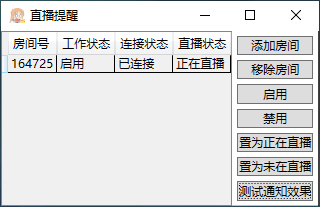
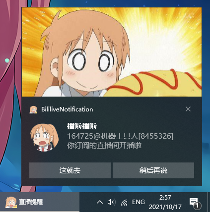

## 哔哩哔哩直播通知
以 Windows10 Toast 的形式提醒开播  
支持 `net7.0` / `net6.0` / `net5.0` / `netframework4.6.1`

### 注意事项
[点我下载](../../releases), 解压即用  
`net7.0` 需要的运行时: [点我下载](https://dotnet.microsoft.com/zh-cn/download/dotnet/thank-you/runtime-desktop-7.0.5-windows-x64-installer)  
`net6.0` 需要的运行时: [点我下载](https://dotnet.microsoft.com/zh-cn/download/dotnet/thank-you/runtime-desktop-6.0.16-windows-x64-installer)  
`net5.0` 需要的运行时: [点我下载](https://dotnet.microsoft.com/zh-cn/download/dotnet/thank-you/runtime-desktop-5.0.17-windows-x64-installer)  
`netframework4.6.1` 需要的运行时: [点我下载](https://dotnet.microsoft.com/download/dotnet-framework/thank-you/net461-web-installer)  
操作系统版本至少为 `Windows10.0.17763.0` (Windows 10 1809), 否则某些功能将无法使用  
程序会在其所在目录创建 `imgs` 文件夹用于临时存放开播直播间的封面图和主播头像图, 用户可以自行定期清理

### 界面图

### 通知效果图

### 授权
MIT授权

### 引用
- [Microsoft.Toolkit.Uwp.Notifications](https://github.com/CommunityToolkit/WindowsCommunityToolkit) (MIT License)
- [Microsoft.Extensions.DependencyInjection](https://github.com/dotnet/runtime/tree/main/src/libraries/Microsoft.Extensions.DependencyInjection) (MIT License)
- [Microsoft.Extensions.Http](https://github.com/dotnet/runtime/tree/main/src/libraries/Microsoft.Extensions.Http) (MIT License)
- [Microsoft.Extensions.Logging](https://github.com/dotnet/runtime/tree/main/src/libraries/Microsoft.Extensions.Logging) (MIT License)
- [Executorlibs.Bilibili.Protocol](https://github.com/Executor-Cheng/Executorlibs) (MIT License)
